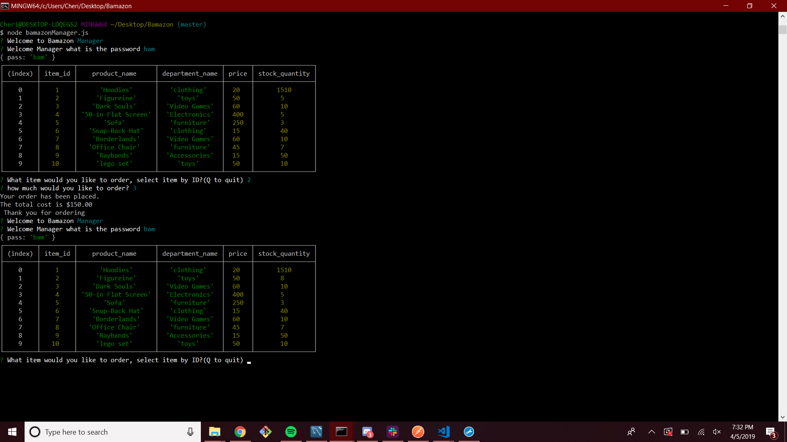
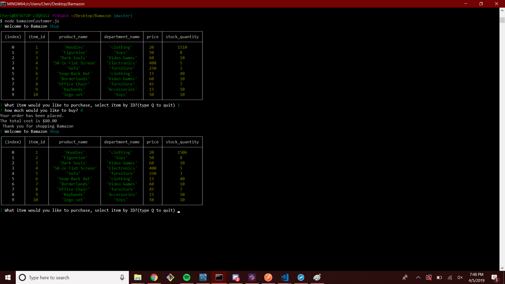

# Bamazon

This app uses mysql and inquierer npms to make a shopping node app, as a bonuse i added a manager node that will allow people who know the password (bam) to order  for the products aswell. Future plans is to add a supervisor js that would allow add products and order inventory for them using another password (amazon).

